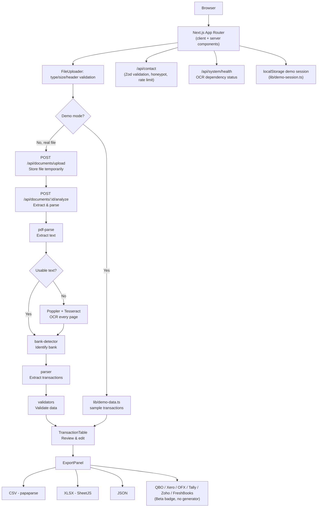

# LedgerFlow AI

> A financial-document conversion platform concept: upload a bank statement PDF and export clean, structured transaction data. PDF text extraction, local OCR fallback, transaction review, and CSV/Excel/JSON export are implemented; database, auth, and most export formats remain scaffolded.


No CI badge, deployment badge, or test-coverage badge is included because none of those are currently configured in this repository.

---

## Status at a glance

| Area | Status |
|---|---|
| Marketing site (homepage, `/tools`, use cases, resources, FAQ, legal pages) | ✅ Implemented |
| PDF upload + client-side validation (type, size, corrupted-header check) | ✅ Implemented |
| Converter workspace UI (processing steps, review table, validation summary) | ✅ Implemented |
| **Real PDF text extraction** | ✅ **Implemented** — uses `pdf-parse` to extract text from PDFs |
| Bank detection from extracted text | ✅ **Implemented** — identifies bank by name/currency patterns |
| **Generic transaction parser** | ✅ **Implemented** — parses common date/amount/description formats |
| Transaction validation | ✅ **Implemented** — flags low-confidence, duplicates, missing data |
| OCR fallback for scanned PDFs | ✅ **Implemented** — Poppler renders every page and local Tesseract reads each page |
| CSV / Excel (.xlsx) / JSON export | ✅ Implemented — generates and downloads real files from extracted data |
| QuickBooks / Xero / OFX / Tally / Zoho Books / FreshBooks export | 🟡 UI + shared interface only, labeled "Beta" in-app — no working generator |
| "Try a sample statement" demo mode | ✅ Implemented — runs the full UI pipeline against bundled sample data |
| Bulk conversion (`/bulk`) | ✅ Implemented against sample data, same caveats as above |
| Contact form (`/contact`) | ✅ Implemented — real Zod validation, honeypot spam check, in-memory rate limiting, server-side `console.log` of submissions. **No email/notification provider is wired up** |
| Login / signup / dashboard / history / files / settings / admin | 🟡 Real, interactive UI, backed by a **client-only `localStorage` demo session** (`lib/demo-session.ts`) — not real authentication, no server-side session, no database |
| Database, Redis/queue, cloud storage, Google OAuth, Docker | ❌ **Not implemented.** Described only in the separate architecture/planning document, not in this codebase |

---

## Product overview

LedgerFlow AI's intended pipeline is:

```
Bank statement PDF
   → Upload & validation
   → Text extraction / OCR
   → Bank detection
   → Transaction extraction
   → Validation
   → User review
   → Export (CSV / Excel / JSON / accounting formats)
```

**In this repository today**, real uploads go through native PDF extraction or automatic OCR fallback, then bank detection, parsing, validation, review, and export. Sample mode remains a separate bundled-data path.

Intended users: accountants, bookkeepers, small businesses, finance teams, tax professionals, and developers/data analysts (see the `/use-cases/*` pages) — this describes intent, not a claim that the product currently serves production workloads for any of these.

---

## Features

### Document processing
- PDF upload with drag-and-drop, and via a file picker (`components/converter/FileUploader.tsx`)
- Client-side validation: file type/extension, non-zero size, 20MB size cap, and a real check that the file begins with the `%PDF-` magic bytes (catches non-PDFs and some corrupted files)
- **Real PDF text extraction** using `pdf-parse` — extracts text from PDF files with usable text layers
- **Bank detection** from extracted text — identifies bank by name and/or currency patterns
- **Generic transaction parser** (`lib/services/parser.ts`) — extracts transactions from common statement formats
  - Supports multiple date formats: DD/MM/YYYY, MM/DD/YYYY, DD MMM YYYY, YYYY-MM-DD
  - Parses amounts in various formats: $1,234.56, €1.234,56, ₹1,23,456, etc.
  - Recognizes debit/credit columns and balances
- **Transaction validation** — flags low-confidence rows, duplicates, and incomplete data for manual review
- Multi-stage processing UI showing real progress (uploading → analyzing → detecting bank → extracting → validating)

### Transaction review
- Normalized transaction type (`types/index.ts`) shared by the UI and every exporter
- Review table: search, per-field filters (all / needs review / high confidence / debit / credit), inline description editing, delete with undo, and pagination (`components/converter/TransactionTable.tsx`)
- Validation summary banner showing total / valid / needs-review counts
- Confidence scores per row, with low-confidence rows visually flagged

### Export — implemented
| Format | Status | Notes |
|---|---|---|
| CSV | ✅ Implemented | via PapaParse, real file download |
| Excel (.xlsx) | ✅ Implemented | via SheetJS — typed dates, number formatting, column widths, frozen header row, autofilter |
| JSON | ✅ Implemented | normalized document + transactions schema |

### Export — Beta / not implemented
| Format | Status | Notes |
|---|---|---|
| QuickBooks (.QBO) | 🟡 Beta (UI only) | Shares the `ExportProvider` interface; no working generator yet |
| Xero | 🟡 Beta (UI only) | Same |
| OFX | 🟡 Beta (UI only) | Same |
| Tally XML | 🟡 Beta (UI only) | Same |
| Zoho Books | 🟡 Beta (UI only) | Same |
| FreshBooks | 🟡 Beta (UI only) | Same |
| Google Sheets | 🟡 Beta (UI only) | No Google OAuth or Sheets API integration exists in this codebase |

Every format above shares one `ExportProvider` interface (`lib/exporters/index.ts`, `lib/exporters/beta.ts`), so implementing a real generator for any of them doesn't require restructuring the app — see that file's comments for the extension point.

### Application shell
- Login / signup / forgot-password pages with real client-side form validation
- Dashboard, history, files, file-detail, and settings pages — real, interactive React UI
- Admin overview page with mock stats and a jobs table
- All of the above run against a `localStorage`-backed "demo session" (`lib/demo-session.ts`), **not** a real authentication system — there is no password hashing, no server session, and nothing protecting any route or API from unauthorized access. This is explicitly disclosed to the user in-app via `components/dashboard/BackendRequiredBanner.tsx` and in the login form itself
- Bulk conversion page (`/bulk`) with per-file status tracking, simulated per-file failure handling, and combined/individual CSV export — against generated sample data, same caveats as the single-converter workspace

### Not implemented anywhere in this codebase
Database, user accounts, real authentication/authorization, Google OAuth, Redis/job queue, background workers, cloud object storage, Docker, automated tests, and CI remain outside this prototype.

---

## Screenshots

No screenshots currently exist in this repository. If you add some, a natural place is a new `docs/screenshots/` directory, referenced here as:

```markdown

```

## Demo

No live/hosted demo URL currently exists for this project. Locally, the closest thing to a demo is:

1. Run the app locally (see [Run locally](#run-locally))
2. Open any converter, e.g. `/tools/bank-statement-to-csv`
3. Click **"Try a sample statement instead"**

This runs the complete UI pipeline — processing animation, bank detection panel, transaction review, validation summary, and a real CSV/Excel/JSON download — against bundled sample data (`lib/demo-data.ts`). Nothing here reads a real PDF.

---

## Tech stack

| Layer | Technology | Notes |
|---|---|---|
| Framework | Next.js 16 (App Router) | `next@16.3.4` |
| Language | TypeScript 5 | strict mode |
| UI library | React 19 | |
| Styling | Tailwind CSS v4 | CSS-variable design tokens in `app/globals.css`, no component library (no shadcn/ui is installed) |
| Icons | lucide-react | |
| **PDF extraction** | **pdf-parse** | **Extracts text from PDF files** |
| **OCR** | **Tesseract CLI** | **Local OCR for scanned PDFs, with TSV confidence values** |
| **PDF rendering** | **Poppler `pdftoppm`** | **Renders every scanned PDF page to PNG** |
| **IDs/UUID** | **uuid** | **Generates unique document IDs** |
| CSV | papaparse | real, working export |
| Excel | xlsx (SheetJS) | real, working export |
| Validation | zod | used in `lib/validation/contact.ts` and the `/api/contact` route |
| Class utilities | clsx, tailwind-merge | via `lib/cn.ts` |
| Linting | ESLint 9 (flat config), eslint-config-next | |

Not present in this repository (do not assume otherwise): Prisma, PostgreSQL, Redis, BullMQ, Auth.js/NextAuth, any Python component, any cloud storage SDK, Docker, or a test runner. Tesseract and Poppler are local system dependencies for scanned PDFs.

---

## System architecture

### As implemented today



### Future enhancements (not yet built)

The project's separate architecture document describes a future system with:
- PostgreSQL + Prisma for persistent storage
- Redis/BullMQ for background job processing
- S3-compatible cloud storage for uploaded files
- Auth.js for real authentication

Those infrastructure components do not exist in this source tree today; local OCR via Tesseract and Poppler is implemented separately and documented above.

---

## Requirements

### Required
- **Node.js ≥ 20.9.0** — this is the exact minimum declared by `next@16.3.4`'s own `engines` field, not a guess
- npm (this repo has a `package-lock.json`; use npm, not yarn or pnpm, to keep the lockfile consistent)
- Git

### Optional
- **Tesseract OCR and Poppler** — required for scanned/image-based PDFs. Text-based PDFs work without them.
- No database, Redis, Docker, or third-party API credentials are required.

---

## Node.js version

```bash
node --version
npm --version
```

You need Node **20.9.0 or newer**. `package.json` in this repo doesn't declare an `engines` field itself, but its Next.js version does, and the app will fail to build/run correctly on older Node versions.

---

## Clone the repository

```bash
git clone <YOUR_GITHUB_REPOSITORY_URL>
cd ledgerflow
```

---

## Install dependencies

This repo ships a `package-lock.json`, so use npm:

```bash
npm install
```

---

## Local OCR setup

Text PDFs need no system dependencies. Scanned PDFs automatically use Poppler and Tesseract on the server running Next.js.

### How OCR is included in this project

OCR is already integrated into the application; do not install an npm OCR package or add OCR code to the React UI. The server-side flow is:

1. `app/api/documents/upload/route.ts` stores the uploaded PDF in a temporary directory.
2. `app/api/documents/[id]/analyze/route.ts` first tries native text extraction with `pdf-parse`.
3. If the extracted text is too short or lacks statement/transaction patterns, the route calls `lib/services/ocr.ts`.
4. `lib/services/ocr.ts` uses Poppler `pdftoppm` to render every page and Tesseract CLI to read each PNG sequentially.
5. OCR text and confidence values are passed into the existing bank detector, transaction parser, validator, review table, and exporters.
6. Temporary rendered page images and the uploaded PDF are deleted after processing.

The implementation checks `TESSERACT_PATH`, then the system `PATH`, then standard installation locations. Poppler follows the same pattern through `POPPLER_PATH`.

### Windows

1. Install Tesseract OCR using the [UB Mannheim Windows installer](https://github.com/UB-Mannheim/tesseract/wiki). During setup, install the English language data and add Tesseract to PATH if offered. The default executable is usually `C:\\Program Files\\Tesseract-OCR\\tesseract.exe`.
2. Download a current [Poppler build for Windows](https://github.com/oschwartman/poppler-windows/releases), extract it, and add its `Library\\bin` directory to PATH. That directory must contain `pdftoppm.exe`.
3. Close and reopen PowerShell so the updated PATH is loaded.
4. Verify both tools:

```powershell
tesseract --version
pdftoppm -h
```

If you do not want to edit PATH, configure the executables for the current PowerShell session:

```powershell
$env:TESSERACT_PATH = 'C:\\Program Files\\Tesseract-OCR\\tesseract.exe'
$env:POPPLER_PATH = 'C:\\tools\\poppler\\Library\\bin\\pdftoppm.exe'
npm run dev
```

Set these variables before starting Next.js. A running server will not see changes made afterward.

### macOS

```bash
brew install tesseract poppler
tesseract --version
pdftoppm -h
```

### Ubuntu/Debian

```bash
sudo apt-get update
sudo apt-get install tesseract-ocr poppler-utils
tesseract --version
pdftoppm -h
```

### Environment variables

PATH is checked first. You may provide absolute executable paths when they are not on PATH:

```powershell
$env:TESSERACT_PATH = 'C:\\Program Files\\Tesseract-OCR\\tesseract.exe'
$env:POPPLER_PATH = 'C:\\Program Files\\poppler\\Library\\bin\\pdftoppm.exe'
```

The application also checks standard Windows installation locations. It never accepts executable paths from uploaded files or browser input. These variables are server-only and must not be prefixed with `NEXT_PUBLIC_`.

Check the local dependency status without exposing secrets:

```text
GET http://localhost:3000/api/system/health
```

The response reports `pdfExtraction`, `ocr`, and `poppler` as `ok` or `unavailable`.

### Test a scanned statement

Run `npm run dev`, open `/tools/bank-statement-to-csv`, and upload a scanned multi-page PDF. The native text quality check will automatically select OCR; each page is rendered and read sequentially, then the resulting text enters the same parser, validation, review, and CSV export flow as a text PDF. OCR confidence is shown in the review summary and low-confidence rows require review.

## Python dependencies

**Not applicable to this repository.** There is no Python code, `requirements.txt`, `pyproject.toml`, or Python service anywhere in this codebase.

## Database setup

**Not applicable.** There is no Prisma schema, no `DATABASE_URL` usage, and no database client anywhere in this source tree. All "data" you see in the dashboard, history, and files pages is hardcoded sample data (`lib/dashboard-demo-data.ts`, `lib/demo-data.ts`) plus a browser-`localStorage` session — nothing is persisted server-side.

## Redis setup

**Not applicable.** No Redis client, no BullMQ, no job queue exists in this codebase. All "processing" you see is a client-side `setTimeout` sequence in `components/converter/ConverterWorkspace.tsx` and `components/converter/BulkWorkspace.tsx`.

---

## Environment variables

The OCR integration reads these optional server-side variables:

| Variable | Purpose | Example |
|---|---|---|
| `TESSERACT_PATH` | Absolute path to the Tesseract executable | `C:\\Program Files\\Tesseract-OCR\\tesseract.exe` |
| `POPPLER_PATH` | Absolute path to `pdftoppm` | `C:\\tools\\poppler\\Library\\bin\\pdftoppm.exe` |

If both tools are on `PATH`, no `.env` file is needed. Otherwise create `.env.local` in the repository root, set these variables, and restart `npm run dev`.

## Google OAuth setup

**Not implemented.** The "Continue with Google (demo)" button on `/login` and `/signup` (`components/marketing/AuthForm.tsx`) does not call Google, does not use OAuth, and does not hit any API — it just writes a fake user object to `localStorage` and redirects to `/dashboard`. There is no Google Cloud project, client ID, client secret, or callback route to configure, because none of that code exists yet.

## S3 / object storage

**Not implemented, but temporary storage is used.** 

- Uploaded PDFs are **temporarily stored** in the system's temp directory (`os.tmpdir()`) during processing
- Files are **not persisted** beyond the current server instance
- There is **no cloud storage SDK** and no permanent file storage
- In production, you would replace the temporary file store (`lib/services/file-store.ts`) with S3, GCS, or similar
- This temporary storage is sufficient for development and MVP testing

## Google Sheets

**Coming Soon** — this is explicitly labeled as Beta in the UI (`data/converters.ts`, `bank-statement-to-google-sheets` entry). No Google Sheets API integration, OAuth scope, or credential handling exists in this codebase.

---

## Run locally

This project has exactly one process to run:

```bash
npm run dev
```

Then open:

```
http://localhost:3000
```

There is no separate worker process, no Redis server, and no database to start — the dev server is the entire application.

---

## First test (manual verification checklist)

1. Open `http://localhost:3000` — homepage loads
2. Go to `/tools` — the converter directory loads with all 10 converters + the "Coming Soon" categorizer card
3. Open `/tools/bank-statement-to-csv`
4. Click **"Try a sample statement instead"** to verify the separate sample flow
5. Watch the simulated processing steps complete
6. Confirm the bank detection panel, validation summary, and transaction table render with sample data
7. Edit a transaction description inline in the table
8. Delete a row, then click **Undo**
9. Click **Generate CSV**, then **Download** — confirm a real `.csv` file downloads with the edited data
10. Repeat for the Excel and JSON converters to confirm real `.xlsx`/`.json` downloads
11. Visit `/bulk`, upload a few arbitrary PDFs, click **Process**, and confirm per-file status and combined CSV export
12. Visit `/login`, use either form or "Continue with Google (demo)" — confirm redirect to `/dashboard` and that the sidebar shows your demo name/email
13. Visit `/contact` and submit the form — confirm a success message (check your terminal running `npm run dev` for the logged submission)

---

## Sample data / demo mode

There is no sample **PDF file** in this repository (no `samples/` directory). Instead, "demo mode" is implemented entirely in code:

- `lib/demo-data.ts` — a hardcoded, fictional 23-transaction statement for "Horizon National Bank," used by every converter's "Try a sample statement instead" button
- `lib/bulk.ts` — generates a small fictional multi-file batch (reusing/slicing the same dataset, including one deliberately-failing file) for the `/bulk` page
- `lib/dashboard-demo-data.ts` — hardcoded history and file rows shown in the dashboard

All of it is clearly labeled "Sample data" / "Demo" in the UI wherever it appears.

---

## Available npm scripts

```json
"dev": "next dev",
"build": "next build",
"start": "next start",
"lint": "eslint"
```

| Command | Purpose |
|---|---|
| `npm run dev` | Start the development server at `localhost:3000` |
| `npm run build` | Production build (verified: builds cleanly, statically generates all routes) |
| `npm run start` | Start the production server (run `npm run build` first) |
| `npm run lint` | Run ESLint across the project (verified: passes with zero warnings/errors) |

There is no `test`, `test:e2e`, `worker`, `db:migrate`, or `db:seed` script in `package.json` — don't run commands that aren't listed above.

---

## Production build

```bash
npm run build
npm run start
```

`TESSERACT_PATH` and `POPPLER_PATH` must be available when the server starts if scanned PDFs will be processed. Text-only processing does not require them.

---

## Free deployment

### Option A — Vercel (recommended for this repo as it stands)

Because this app currently has zero server-side dependencies (no database, no Redis, no long-running processes), it deploys to Vercel's free tier with no special configuration:

1. Push this repository to GitHub
2. Import it into Vercel
3. Set `TESSERACT_PATH` and `POPPLER_PATH` in the deployment environment if scanned PDFs are required
4. Deploy

The one API route (`/api/contact`) runs fine as a Vercel serverless/edge function as written. Its rate limiter is in-memory, so it resets on every cold start and doesn't share state across concurrent serverless instances — fine for a low-traffic contact form, not a real abuse-prevention mechanism. Note this, don't rely on it beyond that.

Local CLI OCR may not be available in restricted serverless deployments. Use a Windows/macOS/Linux host or worker with Tesseract and Poppler installed for scanned-PDF processing.

### Option B — Render

Only relevant once a real backend (database, worker, OCR service) is implemented — none of which exists in this repository yet. Render's free tier for a service like that would sleep on inactivity and would need a Postgres add-on and/or Redis add-on provisioned separately; document the actual build/start commands for that service once it exists, rather than inventing them now.

### Option C — Supabase

Only relevant once this project actually uses PostgreSQL, which it does not today. Supabase's free tier is a reasonable choice for that future database, with the usual free-tier caveats (project pausing after inactivity, storage/row limits) — set it up when the Prisma schema in the planning document is actually implemented.

---

## Recommended architecture (today vs. planned)

**Today**, the realistic and honest architecture is:

```
GitHub → Vercel (Next.js app, static + one serverless API route)
```

That's it — there's nothing else to deploy.

**Planned** (not built): once a real backend exists, the planning document's suggested split is a Vercel-hosted frontend/API talking to a Supabase (or similar) Postgres database, with a separate always-on worker service (e.g. Render) for OCR/long-running document processing that wouldn't survive on serverless functions. Build that out before recommending it as this project's actual deployment topology.

---

## Deployment environment variables

For scanned-PDF processing, configure `TESSERACT_PATH` and `POPPLER_PATH` in the deployment environment, or place both executables on the server's `PATH`.

---

## Deployment checklist

### Before deployment
- [x] Build passes (`npm run build` — verified)
- [x] Lint passes (`npm run lint` — verified)
- [ ] No automated tests exist to "pass" — none are configured in this repo
- [x] OCR environment variables documented (`TESSERACT_PATH`, `POPPLER_PATH`)
- [x] `.env*` is already in `.gitignore`
- [ ] No database, so nothing to migrate
- [ ] No OAuth, so no production callback to configure
- [ ] No storage, so nothing to configure
- [ ] Tesseract and Poppler installed and verified on the deployment host
- [ ] No worker/Redis, so nothing to configure

### After deployment
- [ ] Homepage loads
- [ ] `/tools` and each `/tools/[slug]` page load
- [ ] "Try a sample statement" completes and shows transactions
- [ ] CSV/Excel/JSON downloads work
- [ ] `/contact` submits successfully (check function logs for the logged submission)
- [ ] `/login` → demo session → `/dashboard` works
- [ ] Real text and scanned PDF uploads produce transactions derived from the uploaded document

---

## Troubleshooting

Tesseract and Poppler are required for scanned PDFs. The health endpoint identifies which dependency is missing without exposing paths or secrets.

Issues that can actually occur:

**`npm install` fails on an old Node version**
Confirm `node --version` is ≥ 20.9.0. Next 16 requires it.

**Build fails with a module-resolution error on `@/...` imports**
Check `tsconfig.json`'s `paths` config (`"@/*": ["./*"]`) is intact, and that you're running commands from the repository root, not a subdirectory.

**File upload validation rejects a real PDF**
Check the file actually starts with `%PDF-` (some corrupted or non-standard files won't), is under 20MB, and has a `.pdf` extension or `application/pdf` MIME type — see `components/converter/FileUploader.tsx`.

**Real PDF upload never shows extracted transactions**
Check the server terminal and `http://localhost:3000/api/system/health`. Scanned PDFs need both Tesseract and Poppler available to the Next.js process.

**Contact form submission doesn't arrive anywhere**
Expected — no email provider is configured. Check your terminal running `npm run dev` (or your host's function logs in production) for the `[contact] new submission` log line.

---

## Windows setup

```powershell
node --version
npm --version
git --version

git clone <YOUR_GITHUB_REPOSITORY_URL>
cd ledgerflow
npm install
npm run dev
```

Install Tesseract and Poppler for scanned PDFs as described in [Local OCR setup](#local-ocr-setup), verify both commands, then run `npm run dev` and open `http://localhost:3000`.

## macOS setup

```bash
node --version
npm --version

git clone <YOUR_GITHUB_REPOSITORY_URL>
cd ledgerflow
npm install
npm run dev
```

Install `tesseract` and `poppler` with Homebrew as described in [Local OCR setup](#local-ocr-setup).

## Linux setup

```bash
node --version
npm --version

git clone <YOUR_GITHUB_REPOSITORY_URL>
cd ledgerflow
npm install
npm run dev
```

Install `tesseract-ocr` and `poppler-utils` with `apt` as described in [Local OCR setup](#local-ocr-setup).

---

## Docker

**Not applicable.** There is no `Dockerfile` or `docker-compose.yml` in this repository. This README does not invent Docker instructions for a setup that doesn't exist.

---

## Testing

There is no test runner configured in this repository — no Jest, Vitest, Playwright, or Cypress, and no `test` script in `package.json`. The closest things to automated verification are:

```bash
npm run lint    # ESLint — verified passing
npm run build   # Next.js production build + TypeScript check — verified passing
```

`npm run build` does perform a full TypeScript type-check as part of the Next.js build (there's no separate `tsc --noEmit` script defined, but the build will fail on type errors).

---

## Project structure

```text
ledgerflow/
├── app/
│   ├── page.tsx                        # Homepage
│   ├── layout.tsx                      # Root layout, font loading, metadata
│   ├── globals.css                     # Design tokens (colors, type, radii)
│   ├── tools/                          # Converter directory + [slug] workspace
│   ├── use-cases/[slug]/               # 6 use-case pages, data-driven
│   ├── resources/[slug]/               # 5 guide articles, data-driven
│   ├── bulk/                           # Bulk conversion page
│   ├── dashboard/                      # Dashboard, history, files, settings (demo-session-gated)
│   ├── admin/                          # Admin overview (mock data)
│   ├── login/ signup/ forgot-password/ # Auth UI (demo session only)
│   ├── pricing/ faq/ security/ privacy/ terms/ contact/ how-it-works/
│   ├── api/
│   │   ├── contact/route.ts            # Contact form (Zod validation, rate limiting)
│   │   ├── system/health/route.ts      # Tesseract/Poppler health check
│   │   └── documents/
│   │       ├── upload/route.ts         # PDF upload endpoint
│   │       └── [id]/analyze/route.ts   # PDF analysis, OCR fallback & extraction
├── components/
│   ├── converter/                      # Upload, processing, review, export UI
│   ├── dashboard/                      # Sidebar, shell, backend-required banner
│   ├── marketing/                      # Navbar, footer, hero, forms, page shell
│   └── ui/                             # Button, Badge primitives
├── lib/
│   ├── services/
│   │   ├── pdf-extractor.ts            # PDF text extraction (pdf-parse)
│   │   ├── ocr.ts                      # Poppler rendering + Tesseract OCR
│   │   ├── bank-detector.ts            # Bank detection from extracted text
│   │   ├── parser.ts                   # Generic transaction parser
│   │   ├── validators.ts               # Transaction validation & flagging
│   │   └── file-store.ts               # Temporary file storage management
│   ├── exporters/                      # ExportProvider interface + CSV/XLSX/JSON + beta stubs
│   ├── demo-data.ts                    # Sample statement data
│   ├── dashboard-demo-data.ts          # Sample dashboard/history/files data
│   ├── bulk.ts                         # Sample batch generator
│   ├── demo-session.ts                 # localStorage-based fake session
│   ├── validation/contact.ts           # Zod schema for the contact form
│   └── cn.ts                           # clsx + tailwind-merge helper
├── data/                                # converters.ts, use-cases.ts, resources.ts registries
├── types/index.ts                       # Shared domain types
├── public/                              # Default Next.js starter assets (unused by custom UI)
├── package.json
├── tsconfig.json
└── next.config.ts
```

No `prisma/`, `workers/`, or `tests/` directory exists in this repository.

---

## API overview

This repository has two categories of API routes:

**Form submission:**
- `POST /api/contact` — Contact form with Zod validation, honeypot spam check, rate limiting

**Document processing (new):**
- `POST /api/documents/upload` — Receive and store PDF temporarily, return unique document ID
- `POST /api/documents/:id/analyze` — Extract text, detect bank, parse transactions, validate data
- `GET /api/system/health` — Report PDF extraction, Tesseract, and Poppler availability without exposing paths or secrets

The document processing endpoints handle the complete extraction pipeline:
1. PDF text extraction via `pdf-parse`
2. If text quality is insufficient, Poppler renders every page and Tesseract performs local OCR
3. Bank detection via pattern matching
4. Transaction parsing via generic parser (date/amount/description)
5. Transaction validation (flags duplicates, low-confidence, incomplete data)
6. Returns extracted transactions ready for review/export

---

## Security

Implemented:
- Client-side file validation (type, size, corrupted-header check)
- Server-side file validation on upload
- **Real PDF text extraction** (no fabrication of transactions from arbitrary files)
- Transaction validation & confidence scoring
- Honeypot spam field + basic in-memory rate limiting on `/api/contact`
- No secrets, API keys, or credentials exist anywhere in this codebase to leak

Not implemented (and not claimed): authentication/authorization of any kind beyond a disclosed client-side demo session, CSRF protection, signed URLs, database security, or any form of encryption-at-rest — because there is no database yet. No security certification (SOC 2, ISO 27001, etc.) is claimed, because none exists.

---

## Data privacy

- **Uploaded files** are temporarily stored in `os.tmpdir()` during processing and not persisted to disk after the processing completes
- **No data is sent off-device** — PDF processing happens locally on your server
- **Demo/sample transaction data** shown in the converter and dashboard is hardcoded in the repository (`lib/demo-data.ts`, `lib/dashboard-demo-data.ts`) — it is not real user data and is not persisted anywhere
- **The "demo session"** (name/email you enter on `/login` or `/signup`) is stored only in your browser's `localStorage`, under the key `ledgerflow_demo_session`. Nothing is sent to a server
- **Contact form submissions** are validated server-side and written to the server's console log (`console.log`) — not stored in a database, not emailed anywhere
- Retention policy is not currently automated because there is no persistent storage for this app to retain data in

---

## Limitations

- **PDF text extraction** uses `pdf-parse`; scanned/image-based PDFs automatically fall back to local Tesseract OCR after Poppler renders every page
- **OCR confidence** is captured from Tesseract TSV output; low-confidence OCR rows are flagged for review
- **Bank detection** works via pattern matching (bank name, account number, currency); lower confidence if bank-specific patterns aren't recognized
- **Generic transaction parser** handles common formats but may require manual review for unusual layouts
- **No bank-specific parsers** yet — the generic parser works for most banks but is not optimized for specific statement formats
- 7 of 10 export formats are UI-only ("Beta" badge) with no working generator behind them
- No real authentication — the login/dashboard flow is a disclosed client-side demo, not access control
- No persistence for uploaded files — they're stored temporarily in `os.tmpdir()` during processing
- Temporary file storage doesn't persist across server restarts
- No automated tests exist
- No rate limiting beyond the one contact-form route, and that limiter is in-memory only (not safe against distributed abuse or serverless cold-start resets)
- Free-tier hosting caveats: Vercel serverless functions have 10-second timeouts; large PDFs or heavy OCR may timeout on free tier

---

## Roadmap

- [x] Marketing site and all converter/use-case/resource pages
- [x] PDF upload with real client-side validation
- [x] Transaction review UI (search/filter/edit/undo)
- [x] CSV export
- [x] Excel (.xlsx) export
- [x] JSON export
- [x] Demo mode with sample data
- [x] Bulk conversion UI
- [x] Contact form with real validation, spam protection, and rate limiting
- [x] **Real PDF text extraction** (pdf-parse)
- [x] **Bank detection** from extracted text
- [x] **Generic transaction parser** (dates, amounts, descriptions)
- [x] **Transaction validation & flagging**
- [x] OCR fallback for scanned statements (Tesseract + Poppler, multi-page)
- [ ] Bank-specific parser registry
- [ ] Real QuickBooks / Xero / OFX / Tally / Zoho Books / FreshBooks generators
- [ ] Real authentication (replacing the localStorage demo session)
- [ ] PostgreSQL + Prisma persistence
- [ ] Redis/BullMQ background job processing
- [ ] Cloud object storage for uploaded files
- [ ] Automated tests

---

## Contributing

1. Fork the repository
2. Create a branch: `git checkout -b feature/your-feature`
3. Install dependencies: `npm install`
4. Make your changes (configure Tesseract and Poppler when testing scanned PDFs)
5. `npm run lint` and `npm run build` — both must pass
6. Open a pull request describing what changed and, if you're adding a feature described as "not implemented" above, update this README's [Status at a glance](#status-at-a-glance) table accordingly

---

## License

License has not yet been specified.

---

## Author

Built with Next.js, TypeScript, and Tailwind CSS.
